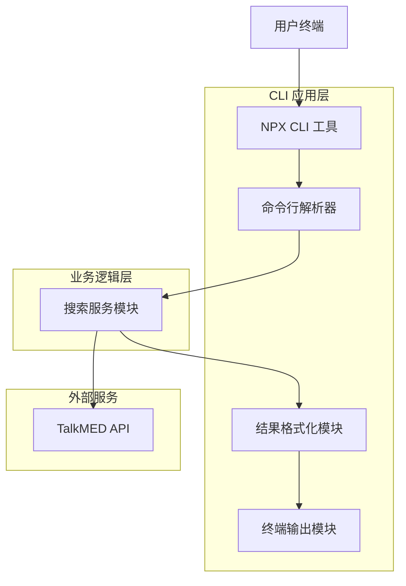
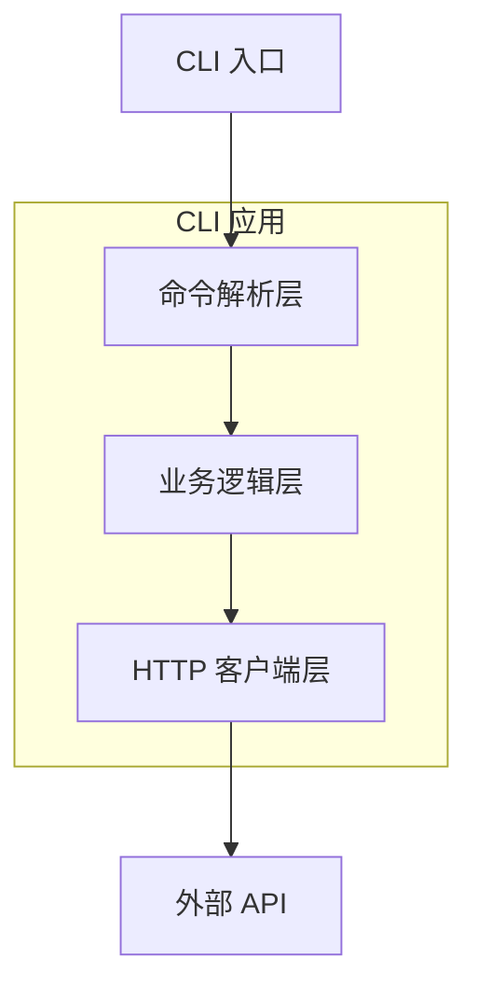
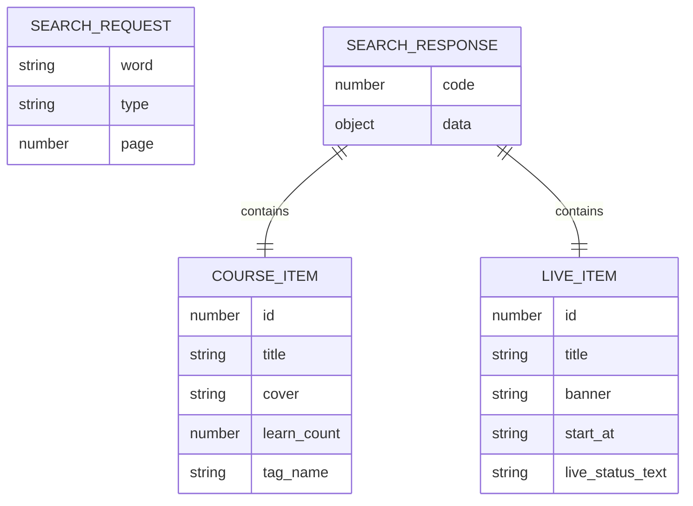

# TalkMED MCP 搜索工具技术架构文档

## 1. Architecture design



## 2. Technology Description

- Frontend: Node.js CLI 应用
- 核心依赖: commander.js@11 + axios@1 + chalk@5 + inquirer@9
- 打包工具: 无需打包，直接通过 npx 执行

## 3. Route definitions

| 命令 | 功能描述 |
|------|----------|
| `npx talkmed-search <keyword>` | 基础搜索命令，搜索指定关键词 |
| `npx talkmed-search <keyword> --type <type>` | 按类型搜索（all/course/live） |
| `npx talkmed-search <keyword> --page <number>` | 指定页码搜索 |
| `npx talkmed-search --help` | 显示帮助信息 |
| `npx talkmed-search --version` | 显示版本信息 |

## 4. API definitions

### 4.1 Core API

TalkMED 搜索接口
```
GET https://apiportal.talkmed.com/v1/pc/search
```

请求参数:
| 参数名 | 参数类型 | 是否必需 | 描述 |
|--------|----------|----------|------|
| word | string | true | 搜索关键词 |
| type | string | false | 搜索类型，可选值：all, course, live |
| page | number | false | 页码，默认为 1 |

响应格式:
| 字段名 | 字段类型 | 描述 |
|--------|----------|------|
| code | number | 响应状态码，0 表示成功 |
| data | object | 响应数据 |
| data.course | object | 课程数据 |
| data.live | object | 会议数据 |

示例响应:
```json
{
  "code": 0,
  "data": {
    "course": {
      "title": "课程",
      "items": [
        {
          "id": 1235,
          "title": "ELCC 2025 | SBRT联合免疫治疗在早期非小细胞肺癌中的应用前景",
          "cover": "https://cdn.edstatic.com/...",
          "learn_count": 12,
          "tag_name": "课程"
        }
      ],
      "has_more": true
    },
    "live": {
      "title": "会议",
      "items": [
        {
          "id": 514,
          "title": "7月8日肺癌诊疗创新与发展系列研讨会",
          "banner": "https://cdn.edstatic.com/...",
          "start_at": "2025-07-08 14:00:00",
          "live_status_text": "已结束"
        }
      ]
    }
  }
}
```

## 5. Server architecture diagram



## 6. Data model

### 6.1 Data model definition



### 6.2 Data Definition Language

由于这是一个纯客户端 CLI 工具，不需要数据库存储，所有数据都通过 API 实时获取。

核心数据结构定义（TypeScript）:

```typescript
// 搜索请求接口
interface SearchRequest {
  word: string;
  type?: 'all' | 'course' | 'live';
  page?: number;
}

// 搜索响应接口
interface SearchResponse {
  code: number;
  data: {
    course?: {
      title: string;
      items: CourseItem[];
      has_more: boolean;
    };
    live?: {
      title: string;
      items: LiveItem[];
    };
  };
}

// 课程项目接口
interface CourseItem {
  id: number;
  title: string;
  cover: string;
  thumb_cover: string;
  learn_count: number;
  tag_name: string;
  action: {
    type: number;
    data: { id: number };
  };
}

// 会议项目接口
interface LiveItem {
  id: number;
  title: string;
  banner: string;
  start_at: string;
  end_at: string;
  live_status: number;
  live_status_text: string;
  tag: string;
}
```