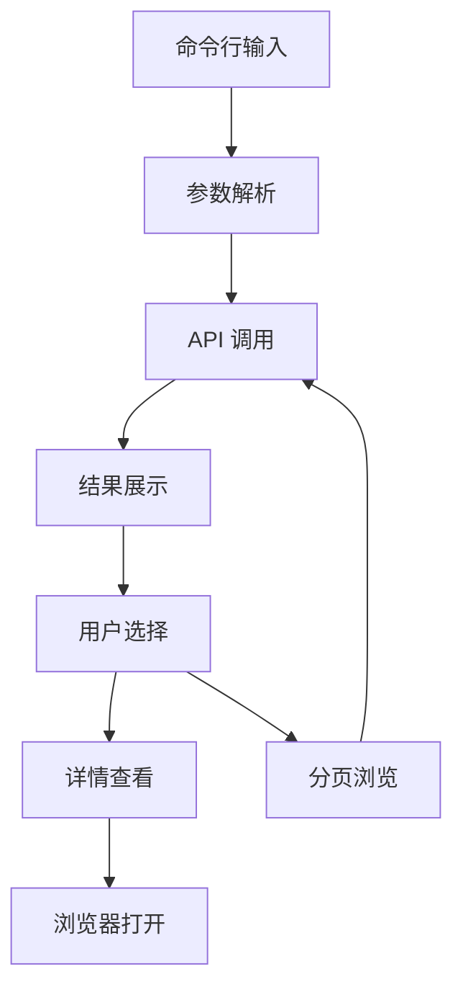

# TalkMED MCP 搜索工具产品需求文档

## 1. Product Overview

TalkMED MCP 搜索工具是一个基于命令行的医学内容搜索工具，通过 npx 命令快速访问 TalkMED 平台的医学资源。
该工具帮助医学专业人士和研究者快速搜索和获取医学课程、会议、研究等内容，提高医学信息检索效率。
目标是为医学从业者提供便捷的命令行搜索体验，支持快速查找相关医学资源。

## 2. Core Features

### 2.1 User Roles

| Role | Registration Method | Core Permissions |
|------|---------------------|------------------|
| 普通用户 | 无需注册，直接使用 | 可搜索和查看所有公开医学内容 |

### 2.2 Feature Module

我们的 TalkMED MCP 搜索工具包含以下主要功能模块：
1. **命令行搜索界面**：关键词输入、搜索参数配置、结果展示
2. **搜索结果展示**：分类显示、详细信息、分页浏览
3. **内容详情查看**：课程详情、会议信息、相关链接

### 2.3 Page Details

| Page Name | Module Name | Feature description |
|-----------|-------------|---------------------|
| 命令行搜索界面 | 搜索输入模块 | 接收用户输入的关键词、类型筛选参数、分页参数 |
| 命令行搜索界面 | 参数配置模块 | 支持搜索类型选择（all/course/live）、分页设置、输出格式配置 |
| 搜索结果展示 | 结果列表模块 | 按分类展示搜索结果，包括课程、会议等内容的标题、描述、封面图 |
| 搜索结果展示 | 分页导航模块 | 支持上一页、下一页、跳转到指定页面功能 |
| 内容详情查看 | 详情显示模块 | 展示选中内容的完整信息，包括标题、描述、时间、讲师等 |
| 内容详情查看 | 链接跳转模块 | 提供原始链接，支持在浏览器中打开完整内容 |

## 3. Core Process

用户通过命令行执行 `npx talkmed-search [关键词]` 开始搜索流程。系统接收搜索参数后调用 TalkMED API 获取数据，然后在终端中格式化展示搜索结果。用户可以通过交互式界面浏览不同页面的结果，选择感兴趣的内容查看详情，或直接在浏览器中打开原始链接。

## 4. User Interface Design

### 4.1 Design Style

- 主色调：蓝色系（#2563EB）和绿色系（#059669）
- 界面风格：简洁的命令行风格，使用 ASCII 字符和颜色高亮
- 字体：等宽字体，支持中英文混合显示
- 布局风格：垂直列表布局，清晰的分隔线和缩进
- 图标风格：使用 Unicode 符号和 emoji 增强视觉效果

### 4.2 Page Design Overview

| Page Name | Module Name | UI Elements |
|-----------|-------------|-------------|
| 命令行搜索界面 | 搜索输入模块 | 命令行提示符、参数说明、进度指示器 |
| 搜索结果展示 | 结果列表模块 | 分类标题、编号列表、高亮关键词、颜色区分不同类型 |
| 搜索结果展示 | 分页导航模块 | 页码显示、导航提示、快捷键说明 |
| 内容详情查看 | 详情显示模块 | 格式化文本、关键信息高亮、清晰的层级结构 |

### 4.3 Responsiveness

该工具为命令行应用，主要适配终端环境，支持不同终端窗口大小的自适应显示，确保在各种终端环境下都有良好的可读性。